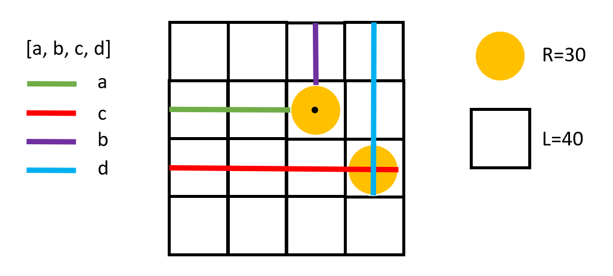

Some selfdefined environments for RL algorithms.

# 1. gui_HellOrTreasure/* & gui_maze/*
These two environments are very similar in terms of implementation, i.e., most codes are exactly same.

## I. About the map (json) file
An example of gui_HellOrTreasure/*
```
{
  "height": 6,
  "width": 6,
  "exit": [[1, 5]],
  "player": [[3, 0]],
  "hells": [[1, 2], [2, 2], [3, 2], [3, 5], [4, 5]]
}
```
- "height" & "width" must be *int* type.
- "exit", "player" & "hells"/"obstacles" must be *list in list*, even though only comprise one element.

## II. Action space
Legal actions are of *int* type in [0, 3]
- 0 -- "move up"
- 1 -- "move down"
- 2 -- "move left"
- 3 -- "move right"

## III. Its coordination style and two types of observations
**1)** Coordination style

Coordination provided in the map/json file is a **matrix transpose** of the real coordination in the maze.
For example,

The real full observation corresponding to the above map/json file is as follows:
```
[[ 0.  0.  0.  1.  0.  0.]
 [ 0.  0.  0.  0.  0.  0.]
 [ 0. -1. -1. -1.  0.  0.]
 [ 0.  0.  0.  0.  0.  0.]
 [ 0.  0.  0.  0.  0.  0.]
 [ 0.  2.  0. -1. -1.  0.]]
```

**2)** gui_HellOrTreasure/* & gui_maze/* all support two types of observations.

- full observation -- The whole maze in the form of a matrix, e.g.,
```
[[ 0.  0.  0.  0.]
 [ 0.  1. -1.  0.]
 [ 0. -1.  2.  0.]
 [ 0.  0.  0.  0.]]
```

- real coordination -- The real coordination of a object in the form of a four-elements array. Now, 
this type of observation only support "the player" object. e.g.,
```
[45.0, 5.0, 75.0, 35.0]
```

